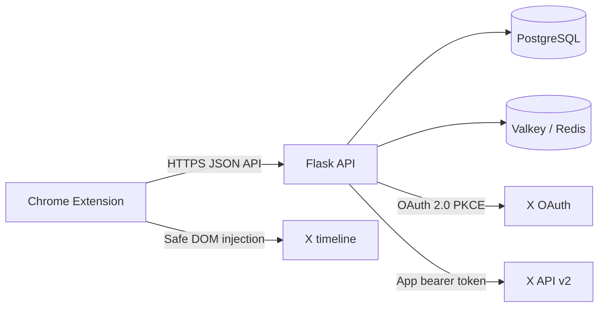

# VisionX Architecture

## Components

- The extension owns authentication UI, sharing controls, API token refresh,
  and content injection.
- The Flask application owns identity, authorization, X account verification,
  feed retrieval, caching, and structured errors.
- PostgreSQL is the durable store. Valkey is used only for shared rate-limit
  counters.

## Authentication

VisionX passwords are hashed with bcrypt. Login and registration return a
15-minute JWT access token and an opaque refresh token. Only the refresh-token
hash is stored. Every refresh rotates the token; replaying an already rotated
token revokes the active token family.

## X Account Linking

1. An authenticated user starts X OAuth.
2. VisionX creates a random state and PKCE verifier with a ten-minute expiry.
3. The callback consumes the state before exchanging the authorization code.
4. `/2/users/me` verifies the X identity and confirms the account is public.
5. VisionX stores only the public identity fields and discards the X user
   access token.

VisionX requests `tweet.read users.read` and does not request
`offline.access`.

## Feed Retrieval

An owner grants another VisionX user access through one `feed_shares` row. The
viewer can request the owner’s feed only while that row exists and the owner
has a linked public X account.

The backend calls `/2/users/{id}/tweets` with its application bearer token,
excluding replies and reposts by default. Results are normalized into a stable
post schema and cached for fifteen minutes. The extension renders text through
`textContent`, accepts only HTTPS media links, deduplicates post IDs, and
places all injected content in one removable container.

## Data Model

| Table | Purpose |
| --- | --- |
| `users` | VisionX identity and bcrypt password hash |
| `feed_shares` | Owner-to-viewer authorization relationship |
| `x_accounts` | Verified public X identity, without user tokens |
| `refresh_tokens` | Hashed rotating VisionX refresh tokens |
| `oauth_link_states` | Expiring single-use OAuth state and PKCE verifier |
| `feed_cache` | Fifteen-minute normalized public post cache |

The initial Alembic migration works on a fresh database or the legacy schema.
It preserves `users`, bcrypt hashes, and `feed_shares`, then drops the legacy
cookie, fetched-feed, and token-derived tweet tables.
